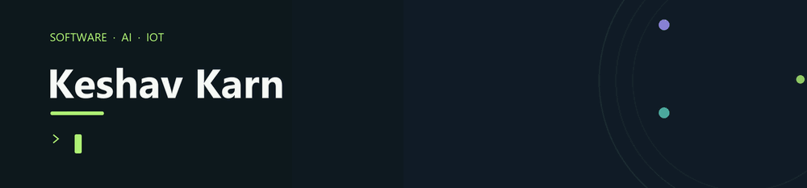

  <a href="https://github.com/kashnordeen">GitHub</a> ·
  <a href="https://www.linkedin.com/in/keshav-karn-933910352/">LinkedIn</a>

## About

I’m a Computer Science student at Thapar Institute of Engineering and Technology. I build practical software across full-stack web, native Android, AI/ML, and connected IoT systems, with a focus on secure, dependable user experiences.

## Featured work

| Project | What it does |
| --- | --- |
| [GramFlow](https://github.com/kashnordeen/GramFlow) | Inventory, sales, receivables, and accounting in a multi-business web workspace. |
| [De-Insure](https://github.com/kashnordeen/De-Insure-A-Parametric-Insurance-Framework-for-Cold-Chain-Logistics) | Cold-chain monitoring and parametric insurance combining IoT telemetry, ML, and smart contracts. |
| [FINDORA](https://github.com/kashnordeen/FINDORA) | Campus lost-and-found with multimodal AI matching and privacy-aware contact sharing. |
| [Downloads Organizer](https://github.com/kashnordeen/downloads-organizer) | A local-first desktop app for previewing, sorting, and safely undoing file moves. |

## Toolbox

**Web:** React, Next.js, TypeScript, FastAPI, PostgreSQL  
**Mobile:** Kotlin, Jetpack Compose  
**AI and data:** PyTorch, multimodal retrieval, pgvector  
**Systems:** Docker, AWS IoT, Solidity

